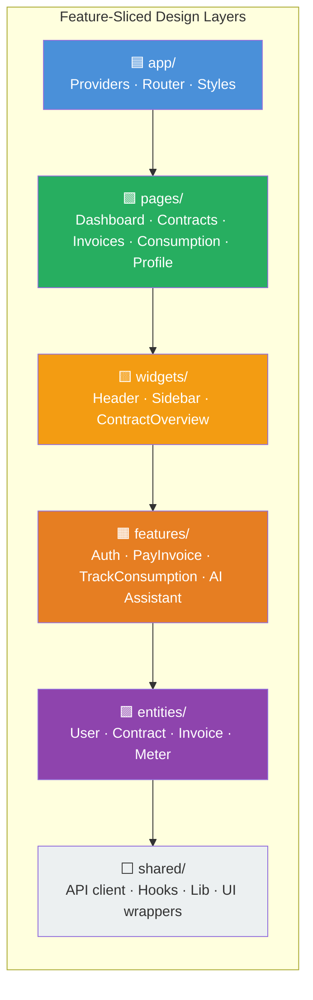
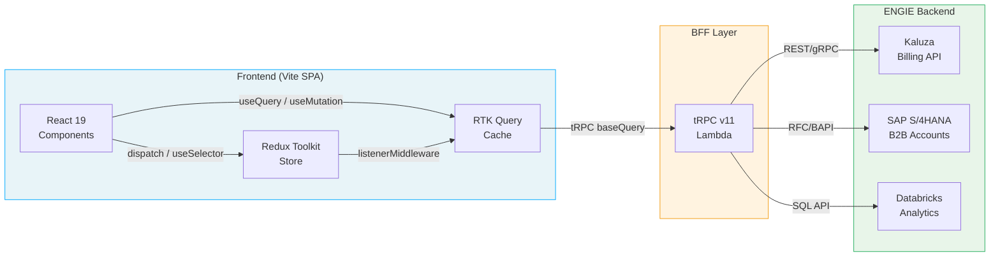
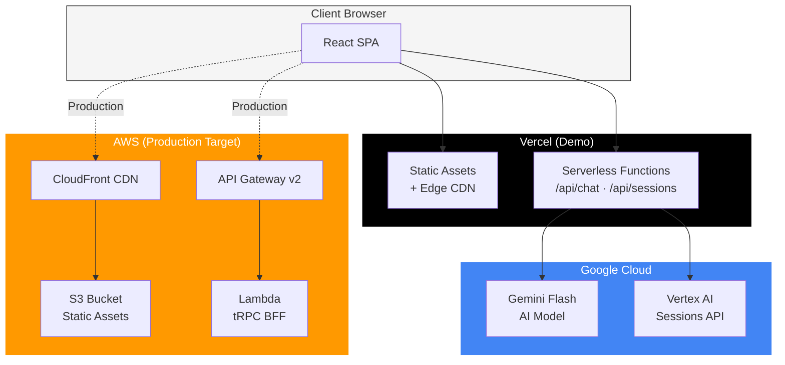
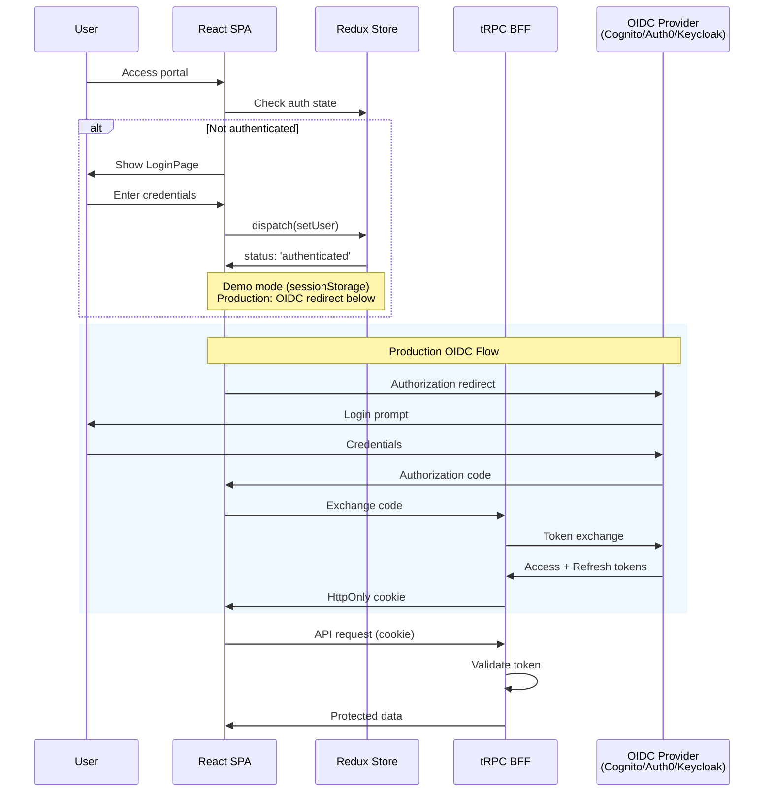
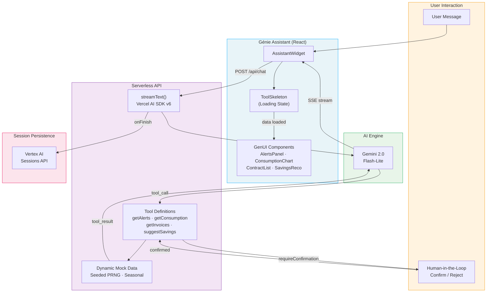

# ENGIE Customer Portal — Bootstrap Plan

## Context & Problem Statement

ENGIE is rebuilding its entire **Sales-to-Cash** (Meter-to-Cash) chain. The central ERP — **Kaluza** (SaaS Energy Intelligence Platform by OVO Energy, signed Sep 2025) — handles real-time billing, smart-meter ingestion, and payment processing for 20M+ consumer contracts. Around Kaluza, ENGIE builds ~15 satellite apps. This project bootstraps the **new customer web portal** (10M users, BtoB + BtoC) as a React SPA with a BFF layer, using ENGIE's official **Fluid Design System**.

**Team:** 4 FTE (1 Tech Lead + 3 senior devs), collaborating with BAs, product, and stakeholders.
**Global stack constraint:** Java, AWS, React, Python, Databricks, Flutter, Copilot.

### ENGIE Technology Ecosystem Context

Understanding the broader ENGIE Digital landscape this portal operates within:

| Domain | Technology | Context |
|--------|-----------|---------|
| **Backend** | Java (Spring Boot, Micronaut) + Node.js/TS | Enterprise microservices, GraalVM for Lambda cold-start optimization |
| **Cloud** | AWS (primary) + Azure (IoT edge cases) | S3, Lambda, API Gateway, DynamoDB, RDS, Redshift. FinOps culture |
| **Data Platform** | Databricks (Lakehouse) + Apache Airflow (MWAA) | 13x improvement in risk identification. Smart Inbox (GenAI email classification), predictive maintenance, trading analytics |
| **Mobile** | Flutter (field tech apps) + React Native | Flutter for cross-platform consistency, RN for JS ecosystem integration |
| **Design System** | Fluid Design System v6 (`@engie-group/fluid-design-system-react`) | `NJ` prefix, migrating to Web Components in 2026 |
| **DevOps** | GitHub Enterprise (innersource) + GitHub Actions + Terraform | 70 countries standardized on GitHub. CI/CD via Actions, Jenkins, Octopus Deploy |
| **AI/Dev** | GitHub Copilot (enterprise-wide) | Mandatory AI proficiency for engineering roles. "Verify Before Commit" culture |
| **ERP/Billing** | Kaluza (B2C billing) + SAP S/4HANA (B2B accounts) | Real-time smart meter reads, modular cloud-native microservices |
| **Architecture** | DDD, Clean Architecture, Agile/Scrum | Strong emphasis on Clean Code, Domain-Driven Design |

**Key implications for the portal:**
- Backend team uses Java/Spring Boot — our tRPC BFF is the TypeScript bridge between React frontend and Java microservices
- Databricks data is consumed via APIs (consumption analytics, billing data) — our portal displays this data, doesn't process it
- Flutter exists for mobile field apps — the portal is web-only but shares i18n dictionaries and API contracts
- GitHub Copilot is standard tooling — `.github/copilot-instructions.md` with FSD rules is expected, not optional

---

## Proposed Architecture

### High-Level Stack

| Layer | Technology | Rationale |
|-------|-----------|-----------|
| **Runtime** | React 19 + TypeScript 5.7 (strict) | Latest stable, Compiler auto-memoization, Actions, `use()` hook |
| **Build** | Vite 8 (Rolldown) + Oxc | Rust-based unified bundler (10-30x faster than Rollup), native ESM, `@vitejs/plugin-react` v6 (Babel-free via Oxc). Smaller bundles than Next.js (~42KB vs ~92KB). SPA fits the portal model (no SEO needed) |
| **React Compiler** | `babel-plugin-react-compiler` via `reactCompilerPreset` | Automatic memoization — eliminates manual `useMemo`/`useCallback`. Uses `@rolldown/plugin-babel` path in Vite 8 (Rust port WIP) |
| **Monorepo** | pnpm 10 workspaces + Turborepo v2 | Strict deps, security-by-default (`allowBuilds`, `minimumReleaseAge`), global virtual store, workspace catalogs, remote caching |
| **Design System** | `@engie-group/fluid-design-system-react` v6 + `@engie-group/fluid-design-tokens` | Official ENGIE components (`NJ*` prefix), CSS variables (`--nj-*`), Fluid 6 |
| **Routing** | TanStack Router v1 | Fully type-safe, file-based routing, route-level code splitting, compile-time route validation. See comparison with React Router v7 below |
| **State Management** | Redux Toolkit 2.x + RTK Query | Enterprise guardrails, deep TypeScript integration, `listenerMiddleware` for complex workflows, tag-based cache invalidation, `createEntityAdapter` normalization, `combineSlices` lazy injection, time-travel debugging |
| **Forms** | React 19 Actions + `useActionState` + `useFormStatus` + Zod v3 | Native React form handling, schema validation |
| **i18n** | react-i18next + i18next | Cross-platform (portal + future Flutter bridge), namespace lazy-loading, TMS-ready (Locize/Phrase/Crowdin) |
| **BFF** | tRPC v11 on AWS Lambda + API Gateway HTTP v2 | End-to-end TypeScript type safety, monorepo code sharing. Custom RTK Query `baseQuery` adapter wraps tRPC client for full Redux integration |
| **Auth** | `oidc-client-ts` + `react-oidc-context` (frontend) / BFF `HttpOnly` cookie (production) | Provider-agnostic OIDC/OAuth 2.1 — works with Cognito, Auth0, Keycloak, Azure AD. BFF handles token storage securely |
| **Testing** | Vitest + React Testing Library + Playwright | The 2026 trifecta: unit → component → E2E |
| **Linting** | ESLint 10 flat config + `eslint-plugin-boundaries` (FSD rules) | Mandatory flat config, native JSX reference tracking, improved monorepo config lookup, Node.js ≥20.19 |
| **CI/CD** | GitHub Actions + Turborepo remote cache + SST v4 (→ S3/CloudFront) | OIDC auth to AWS, preview envs per PR, zero long-lived secrets |
| **Observability** | Sentry (error tracking) + Web Vitals reporting | Performance budgets, real-user monitoring |
| **In-App AI Copilot** | Vercel AI SDK v6 + AG-UI protocol | Open-source AI streaming, tool calling, multi-step reasoning. AG-UI for bi-directional agent communication |
| **Generative UI** | Google A2UI (`@a2ui/react` v0.9) + Fluid DS catalog | Agent-generated native UI components — safe as data, expressive as code. Apache 2.0 |

### Architecture Diagrams

#### 1. FSD Layers Overview



#### 2. Data Flow: React → RTK → BFF → Kaluza



#### 3. Deployment Architecture



#### 4. Authentication Flow



#### 5. Génie AI Assistant Flow



---

### Why Vite 8 SPA (not Next.js)?

- **10M users on an authenticated portal** → no SEO requirement (pages are behind login)
- Vite 8 uses Rolldown (Rust bundler): 10-30x faster production builds, unified dev/prod pipeline
- Smaller client bundle (~42KB vs ~92KB)
- Faster DX (HMR in ms vs seconds)
- Simpler infra: S3 + CloudFront static hosting (no Lambda@Edge / server-side rendering needed)
- BFF pattern cleanly separates server concerns into tRPC Lambda

### Routing: TanStack Router vs React Router v7

| Criterion | TanStack Router | React Router v7 |
|-----------|----------------|-----------------|
| **Type safety** | First-class, compile-time route/search param validation via auto-generated route tree | `typegen` provides comparable safety in framework mode; weaker in library/SPA mode |
| **Search params** | Built-in Zod/Valibot schema validation for query strings | Manual, requires custom wrappers |
| **Code splitting** | Automatic per-route, built into file-based router | Route-level via Vite, needs manual lazy config in SPA mode |
| **SSR support** | TanStack Start v1.0 (March 2026) — 13ms avg latency benchmarks | Remix-merged, 18ms avg latency — excellent for SSR |
| **Learning curve** | Steeper, more verbose initial config | Familiar component-based API (10+ years community) |
| **Ecosystem fit** | Native TanStack Query integration, optimized for data-heavy SPAs | Better for progressive enhancement, web standards |

**Decision: TanStack Router** — compile-time type safety for routes + search params, native TanStack Query integration, automatic code splitting. Ideal for a data-heavy SPA/dashboard. React Router v7 is a viable alternative if team familiarity is prioritized.

### State Management: Redux Toolkit 2.x + RTK Query

**Decision: Redux Toolkit 2.x + RTK Query** — the robust, enterprise-grade choice for a 10M-user portal with complex business workflows.

#### Why RTK over TanStack Query + Zustand

| Criterion | Redux Toolkit 2.x + RTK Query | TanStack Query v5 + Zustand v5 |
|-----------|-------------------------------|-------------------------------|
| **Architectural guardrails** | Opinionated slices + endpoints → natural structure for 4+ person teams, rotating devs, and growing codebase | Flexible but fragmentation risk without strict conventions |
| **TypeScript depth** | `.withTypes()` pattern, fully typed `createApi`, `listenerMiddleware`, selectors — deep end-to-end inference | Good typing but spread across two separate libraries with different patterns |
| **Complex workflows** | `listenerMiddleware` replaces Redux-Saga: concurrency control (`cancelActiveListeners`), `fork` for parallel tasks, `condition`/`take` for workflow orchestration | Requires ad-hoc solutions — TQ mutation callbacks + Zustand subscriptions |
| **Cache invalidation** | Declarative tag-based (`providesTags`/`invalidatesTags`) — "set and forget". `invalidationBehavior: 'delayed'` prevents race conditions | Imperative query key management — powerful but manual |
| **Optimistic updates** | `onQueryStarted` + `updateQueryData` + `patchResult.undo()` — built-in rollback pattern | Excellent via `onMutate`/`onError` but requires manual cache manipulation |
| **Entity normalization** | `createEntityAdapter` → O(1) lookups, `transformResponse` integration, memoized selectors | No built-in normalization — manual or third-party |
| **Code splitting** | `combineSlices` + `injectEndpoints` — lazy-load API slices and reducers per route | Naturally code-split (each query is independent) |
| **DevTools** | Unified Redux DevTools with time-travel debugging across all state | Separate TQ DevTools + Zustand → Redux DevTools middleware |
| **Offline support** | `listenerMiddleware` + `redux-persist` for write queue, `refetchOnReconnect` for reads | TQ has `onlineManager` but offline writes need manual orchestration too |
| **Testing** | Real `configureStore` + MSW v2 — test actual reducer logic, optimistic updates, rollbacks | Simpler setup but tests Zustand + TQ separately |

#### RTK Query + tRPC Integration Pattern

Since the BFF uses tRPC v11, RTK Query connects via a **custom callback-based `baseQuery`** that preserves end-to-end type safety:

```typescript
// shared/api/trpcBaseQuery.ts
import type { BaseQueryFn } from '@reduxjs/toolkit/query/react';
import { trpcClient } from './trpcClient';

type TrpcQueryFn = (client: typeof trpcClient) => Promise<unknown>;

export const trpcBaseQuery: BaseQueryFn<TrpcQueryFn, unknown, unknown> = async (queryFn) => {
  try {
    const data = await queryFn(trpcClient);
    return { data };
  } catch (error: any) {
    return { error: { status: 'CUSTOM_ERROR', message: error?.message, data: error?.data } };
  }
};

// Usage in createApi — full tRPC autocomplete preserved:
getContract: builder.query<Contract, string>({
  query: (id) => (client) => client.contract.getById.query(id),
  providesTags: (result, error, id) => [{ type: 'Contract', id }],
}),
```

#### FSD + Redux Store Composition

Redux slices are collocated within FSD layers via the `model/` segment:

| FSD Layer | Redux Content | Example |
|-----------|--------------|---------|
| `entities/contract/model/` | Entity slice + `createEntityAdapter` + selectors | Contract CRUD state, normalized entities |
| `features/pay-invoice/model/` | Feature-specific slice + listeners | Payment flow state, optimistic updates |
| `shared/api/` | Base `createApi` with `trpcBaseQuery`, empty endpoints | `rtkApi.ts` — single API slice per base URL |
| `app/providers/store/` | `configureStore` + `combineSlices` composition | Root store, middleware chain, typed hooks |

**RootState paradox solved** via RTK 2.x `combineSlices().withLazyLoadedSlices<LazyState>()`:
- Static slices (auth, session) loaded at startup
- Feature slices injected dynamically via `rootReducer.inject(featureSlice)` when routes load
- Entity API endpoints injected via `rtkApi.injectEndpoints()` — collocated with each entity's `api/` segment
- Type-safe via `declare module` augmentation — no circular imports

#### Enterprise Patterns

**listenerMiddleware orchestration:**
- `cancelActiveListeners()` for `takeLatest`-style concurrency control
- `fork()` for parallel background tasks within a single listener
- `condition()`/`take()` for workflow pausing (e.g., wait for auth before fetching)
- Typed via `TypedStartListening<RootState, AppDispatch>`

**Offline-first writes:**
- `refetchOnReconnect: true` handles stale reads automatically
- `listenerMiddleware` intercepts mutations when offline → queues in persisted `syncQueue` slice
- On reconnect, listener forks a task to replay queued mutations sequentially

**Undo/redo:**
- `listenerMiddleware` + `getOriginalState()` captures state snapshots
- `patchResult.undo()` for server-rejected optimistic updates
- History stack managed via dedicated slice or listener closure

**Performance at scale:**
- `selectFromResult` narrows component subscriptions → prevents unnecessary re-renders
- `createEntityAdapter` + `transformResponse` → O(1) lookups in normalized cache
- `combineSlices` + `injectEndpoints` → lazy API slice injection per route chunk
- One `createApi` per base URL (tag invalidation only works within a single API slice)

---

## Architecture: Feature-Sliced Design (FSD)

Strict unidirectional dependency rule: **a layer can only import from layers below it**.

```
engie-portal/
├── apps/
│   └── portal/                    # Main customer-facing Vite SPA
│       └── src/
│           ├── app/               # L1: Providers, router config, global styles
│           │   ├── providers/     # Redux store, Auth, i18n, Theme
│           │   ├── router/        # TanStack Router file-based config
│           │   ├── styles/        # Global Fluid CSS imports
│           │   └── main.tsx       # Vite entry
│           ├── pages/             # L2: Route-level composites
│           │   ├── dashboard/
│           │   ├── contracts/
│           │   ├── invoices/
│           │   ├── consumption/
│           │   └── profile/
│           ├── widgets/           # L3: Complex layout blocks
│           │   ├── header/
│           │   ├── sidebar/
│           │   └── contract-overview/
│           ├── features/          # L4: User interactions / business logic
│           │   ├── auth/
│           │   │   ├── ui/
│           │   │   ├── model/     # Redux slice + listenerMiddleware effects
│           │   │   ├── api/       # RTK Query injected endpoints
│           │   │   └── index.ts   # Public API (barrel export)
│           │   ├── pay-invoice/
│           │   ├── track-consumption/
│           │   └── manage-contract/
│           ├── entities/          # L5: Domain models & dumb UI
│           │   ├── user/
│           │   ├── contract/
│           │   ├── invoice/
│           │   └── meter/
│           └── shared/            # L6: App-specific utilities
│               ├── api/           # Base RTK Query `createApi` + tRPC baseQuery
│               ├── hooks/
│               ├── lib/
│               └── ui/            # Fluid DS wrapper components
├── apps/
│   └── storybook/                 # Storybook for internal component dev
├── packages/
│   ├── ui/                        # Shared Fluid DS wrappers + custom components
│   ├── api-client/                # tRPC router types (shared between BFF & portal)
│   ├── config/                    # Shared ESLint 10 flat, TSConfig, Prettier
│   ├── i18n/                      # Shared translation dictionaries
│   └── utils/                     # Pure utility functions
├── services/
│   └── bff/                       # tRPC BFF on AWS Lambda
│       ├── src/
│       │   ├── routers/           # tRPC routers (contracts, invoices, auth…)
│       │   ├── middleware/        # Auth, logging, rate-limiting
│       │   └── handler.ts         # AWS Lambda adapter
│       └── sst.config.ts          # Infrastructure as Code
├── pnpm-workspace.yaml
├── turbo.json
├── .github/
│   └── workflows/
│       ├── ci.yml                 # PR validation (lint, test, build)
│       └── deploy.yml             # Production deploy to AWS
└── sst.config.ts                  # Root SST config (S3/CloudFront for SPA)
```

### Public API Pattern

Every FSD slice (`features/*`, `entities/*`) exposes **only** through its `index.ts`. Direct imports into internal segments (`ui/`, `model/`, `api/`) from other layers are forbidden and enforced by `eslint-plugin-boundaries`.

---

## Implementation Phases (Todos)

### Phase 1 — Monorepo Scaffold
- `scaffold-monorepo`: Initialize pnpm 10 workspace, Turborepo v2, root configs (TSConfig, ESLint 10 flat, Prettier), workspace catalogs, `allowBuilds` security
- `scaffold-portal-app`: Create Vite 8 (Rolldown) + React 19 + TypeScript app in `apps/portal` with `@vitejs/plugin-react` v6 (Oxc transforms)
- `setup-react-compiler`: Configure `babel-plugin-react-compiler` via `reactCompilerPreset` + `@rolldown/plugin-babel` in Vite 8
- `setup-fluid-ds`: Install `@engie-group/fluid-design-system-react`, tokens, CSS injection
- `setup-tanstack-router`: File-based routing with TanStack Router, route tree generation

### Phase 2 — Core Infrastructure
- `setup-redux-store`: Configure `configureStore` with `combineSlices().withLazyLoadedSlices()`, `listenerMiddleware` (prepended), typed hooks via `.withTypes()`, Redux DevTools
- `setup-rtk-query`: Base `createApi` in `shared/api/rtkApi.ts` with custom `trpcBaseQuery`, empty endpoints, `tagTypes` registry
- `setup-trpc-client`: Vanilla tRPC proxy client (no React Query wrappers) in `shared/api/trpcClient.ts`, linked to BFF endpoint
- `setup-i18n`: Configure react-i18next with namespace lazy-loading, FR/EN base dictionaries
- `setup-auth`: `oidc-client-ts` + `react-oidc-context` setup, provider-agnostic `<AuthProvider>`, `useAppAuth()` facade hook, auth Redux slice, protected route wrapper, listener-based token refresh

### Phase 3 — BFF Service
- `scaffold-bff`: Create tRPC BFF in `services/bff/` with AWS Lambda adapter
- `bff-auth-middleware`: OIDC token verification middleware (validates JWT from any OIDC provider via JWKS endpoint)
- `bff-contract-router`: tRPC router for contract CRUD (stub with mock data)
- `bff-invoice-router`: tRPC router for invoice queries
- `bff-sst-infra`: SST config for Lambda + API Gateway HTTP v2

### Phase 4 — Feature Slices (Portal UI)
- `feature-auth`: Login/logout flow, OIDC redirect (provider-agnostic), token refresh, `useAppAuth()` facade
- `feature-dashboard`: Dashboard page with contract overview widget, consumption summary
- `feature-contracts`: Contract list, detail view, management actions
- `feature-invoices`: Invoice list, detail, payment action
- `feature-consumption`: Consumption tracking with charts (lazy-loaded charting lib)
- `feature-profile`: User profile management

### Phase 5 — Testing & Quality
- `setup-vitest`: Vitest config, RTL setup, MSW v2 handlers, `setupStore` factory for isolated Redux test instances
- `setup-playwright`: Playwright config, base fixtures, auth flow helpers
- `write-unit-tests`: Tests for Redux slices, RTK Query endpoints, entities, utils, Zod schemas
- `write-component-tests`: RTL tests with `renderWithProvider` wrapper for critical feature slices
- `write-e2e-tests`: Playwright critical paths (login, dashboard, invoice payment)
- `setup-eslint-boundaries`: FSD boundary rules enforced in ESLint

### Phase 6 — CI/CD & Deployment
- `setup-github-actions-ci`: PR validation pipeline (lint, test, build with Turborepo filter)
- `setup-github-actions-deploy`: Production deploy via SST to S3/CloudFront
- `setup-preview-envs`: PR-based preview environments
- `setup-bundle-analysis`: Bundle size budgets in CI, automated regression alerts
- `setup-sentry`: Error tracking + Web Vitals performance monitoring

### Phase 7 — AI-Augmented Development
- `setup-copilot-rules`: `.github/copilot-instructions.md` with FSD rules, Fluid DS conventions, coding standards
- `setup-plop-generators`: Scaffolding templates for new FSD slices (feature, entity, page, widget)
- `setup-mcp-integration`: MCP server configs for development workflow (Jira, internal APIs)

### Phase 8 — Conversational Interface & Generative UI
- `setup-ai-sdk`: Vercel AI SDK v6 integration — `streamText`, `generateText`, tool definitions with Zod schemas, multi-step reasoning
- `setup-agui-protocol`: AG-UI protocol client (`@ag-ui/react`) — SSE/WebSocket streaming, tool call lifecycle, human-in-the-loop approval events
- `setup-a2ui-renderer`: A2UI React renderer (`@a2ui/react`) with Fluid DS component catalog — maps A2UI abstract types to `NJ*` components
- `feature-ai-assistant`: Conversational assistant widget (sidebar/popup) — natural language billing inquiries, contract navigation, consumption analysis
- `feature-genui-cards`: A2UI-powered dynamic content cards — agent-generated billing summaries, personalized energy recommendations, interactive forms
- `setup-ai-bff-router`: tRPC router for AI agent backend — connects to ENGIE's existing Agentforce/Databricks AI services via AG-UI events

---

## Key Decisions & Conventions

### Coding Conventions
- **Strict TypeScript** (`strict: true`, `noUncheckedIndexedAccess: true`)
- **No default exports** (named exports only for better refactoring & tree-shaking)
- **Barrel exports** via `index.ts` at every FSD slice root
- **Colocation**: tests live next to source (`*.test.tsx` beside `*.tsx`)
- **CSS**: Fluid tokens via CSS variables (`--nj-*`), CSS Modules for custom styles

### Performance Budgets
- **Route chunk**: < 150KB gzipped per route
- **Initial load (LCP)**: < 2.5s on 4G
- **Total JS**: < 300KB gzipped for initial load
- **Core Web Vitals**: LCP < 2.5s, FID < 100ms, CLS < 0.1

### Branch Strategy
- `main` → production
- `develop` → integration
- `feature/*` → feature branches from develop
- PR-based preview environments on every push

### AI Development Workflow
- Copilot/Cursor with `.cursorrules` and `.github/copilot-instructions.md`
- MCP servers for context (Jira, internal APIs, DB schemas)
- Plop.js generators for FSD boilerplate scaffolding
- AI code review via GitHub Copilot code review on PRs

---

## ⚠️ Important Notes

### Custom baseQuery Production Checklist
The tRPC `baseQuery` adapter must follow these enterprise rules:
1. **Always resolve, never throw** — wrap in `try/catch`, return `{ data }` or `{ error }` strictly
2. **Wire the `AbortSignal`** — pass `api.signal` to tRPC client calls for auto-cancellation on unmount
3. **No competing retries** — use RTK Query's `retry` wrapper OR tRPC client retries, never both (avoids "retry storm")
4. **Type the error shape** — define `BaseQueryFn<TrpcQueryFn, unknown, TrpcError>` so `isRejectedWithValue` middleware and UI components get typed errors
5. **Fresh token reads** — always read auth tokens from `api.getState()` inside the async flow, never cache them in closure (stale closure risk)

### Vite 8 Production Risks
- **Lightning CSS strictness** — may reject non-standard CSS from third-party packages. Test Fluid DS CSS thoroughly. If issues arise, configure `css.transformer: 'postcss'` as fallback
- **Shared chunk execution order** — Rolldown has open bugs (#8812) with heavy third-party libs. Pin problematic packages and test runtime initialization
- **Migration path**: use `rolldown-vite` bridge package on Vite 7 first, then upgrade to Vite 8 stable
- **Config renames**: `build.rollupOptions` → `build.rolldownOptions`, `optimizeDeps.esbuildOptions` → `optimizeDeps.rolldownOptions` (compat layer exists but migrate explicitly)

### SST v4 Enterprise Notes
SST v4 is production-ready (Pulumi/Terraform-backed, no CloudFormation limits). Key benefits:
- Near-instant deployments (seconds vs minutes with CDK/CloudFormation)
- Resource Linking — injects endpoints + IAM permissions into app code automatically
- Live Lambda dev (`sst dev`) with hot-reload against real cloud resources
- Multi-provider support (AWS + Cloudflare CDN + Stripe in single `sst.config.ts`)
Known risks: occasional `sst deploy` hangs in headless CI (use timeout + retry), opinionated abstractions may need workarounds for custom infra patterns

### pnpm 10 Security Defaults
pnpm 10 blocks lifecycle scripts by default. Add an `allowBuilds` whitelist in `.npmrc` for packages needing post-install steps (e.g., `esbuild`, `sharp`, `playwright`). Also configure `minimumReleaseAge=1d` (default) to auto-block brand-new packages. Use `pnpm.catalogs` in `pnpm-workspace.yaml` for unified version management across workspace packages.

### ESLint 10 Migration
ESLint 10 removes `.eslintrc` and `.eslintignore` entirely — **only flat config** (`eslint.config.js`) is supported. New native JSX reference tracking eliminates false `no-unused-vars` positives for component usage. Monorepo config lookup now starts from the linted file's directory, enabling per-package configs naturally.

### Vite 8 + React Compiler Note
React Compiler currently requires Babel (`@rolldown/plugin-babel` with `reactCompilerPreset`), which introduces a Babel step in the otherwise all-Rust Vite 8 pipeline. The React team is working on a Rust-native Compiler port. Performance impact: ~10-20% slower build on React files (still dramatically faster than Webpack). Strategy: enable Compiler now for runtime perf gains, and the build penalty will disappear when the Rust port ships.

### React 19 + Redux Toolkit Compatibility
Requires **React-Redux v9.2.0+** and **RTK v2.5.0+**. Key changes:
- `.withTypes()` pattern replaces manual `TypedUseSelectorHook` boilerplate
- React Compiler complements `useSelector` (both use `useSyncExternalStore`) — inline selectors get auto-memoized, but `createSelector` still needed for heavy derivations
- `batch` export removed (React 18+ batches natively)
- Redux must stay in Client Components only (`'use client'` directive) — not relevant for this SPA but important for future SSR

### RTK Query + tRPC Architecture Note
Since the BFF uses tRPC (not REST), RTK Query connects via a **custom callback-based `baseQuery`** instead of `fetchBaseQuery`. This preserves full tRPC type inference (IDE autocomplete on `client.contract.getById.query()`) while gaining all RTK Query benefits (tag invalidation, optimistic updates, cache normalization). The `@rtk-query/codegen-openapi` tool is **not used** — tRPC provides end-to-end types natively, making OpenAPI codegen redundant.

### Fluid DS Migration Path
ENGIE is deprecating framework-specific packages in 2026 in favor of `@engie-group/fluid-design-system-webcomponents`. React 19 natively supports Custom Elements well. Strategy:
1. **Wrap all Fluid components in `packages/ui/`** — migration is a single-package change
2. **For new components**: check `fluid-design-system-webcomponents` availability first — use Web Component version if available
3. **For existing components**: continue using `fluid-design-system-react` v6 (requires React 19+) until Web Component equivalent is released
4. **Tailwind preset**: Fluid now offers a Beta `FluidTailwindPresets` for utility-first CSS — evaluate for custom component styling alongside Fluid tokens

### Cross-Platform Strategy (Flutter Coexistence)
The global stack includes Flutter (used for field technician mobile apps). The portal is web-only, but shares assets:
- **i18n**: Shared translation dictionaries in `packages/i18n/` — JSON format consumable by both react-i18next and Flutter's `intl`
- **API contracts**: `packages/api-client/` tRPC types can generate OpenAPI specs for Flutter consumption
- **Design tokens**: Fluid DS tokens (`--nj-*` CSS vars) have JSON equivalents usable in Flutter's ThemeData
- **No React Native**: The portal doesn't target mobile — Flutter handles that. No shared UI components needed

### Versioning Warning
Fluid uses `GLOBAL.BREAKING.MINOR` (not SemVer). Use `~` tilde ranges in `package.json` to avoid surprise breaking layout changes.

### Authentication — Provider-Agnostic OIDC/OAuth 2.1

The portal's auth layer is **frontend-focused and identity-provider-agnostic**. The actual IdP choice (Cognito, Auth0, Keycloak, Azure AD) is an infrastructure decision made by the platform/architecture team — our frontend must work with any OIDC-compliant provider.

#### Frontend Auth Stack

| Library | Role |
|---------|------|
| **`oidc-client-ts`** | Core OIDC engine — Authorization Code Flow + PKCE, token lifecycle, silent renew |
| **`react-oidc-context`** | React wrapper — `<AuthProvider>`, `useAuth()` hook, `withAuthenticationRequired()` HOC |
| **Zod** | Validate ID token claims shape (tenant ID, roles) at runtime |

#### Two-Tier Auth Architecture

**Development / Low-risk:** `react-oidc-context` runs OIDC flow in-browser (public client). Tokens stored **in-memory only** (never `localStorage`). Silent renew via hidden iframe or service worker. Acceptable for dev/staging.

**Production (recommended):** The tRPC BFF acts as a **confidential OIDC client**. The SPA redirects to BFF → BFF performs OIDC flow with IdP → stores tokens server-side → issues `HttpOnly`, `Secure`, `SameSite=Strict` session cookie to the browser. This is the **IETF-recommended pattern** (RFC 9700) for enterprise SPAs — completely eliminates token exfiltration via XSS.

```typescript
// features/auth/model/authSlice.ts — provider-agnostic
interface AuthState {
  user: { sub: string; email: string; tenantId: string; roles: string[] } | null;
  status: 'idle' | 'loading' | 'authenticated' | 'error';
}

// features/auth/lib/useAppAuth.ts — facade pattern (abstracts oidc-client-ts)
export function useAppAuth() {
  const oidc = useAuth(); // from react-oidc-context
  const dispatch = useAppDispatch();
  // Sync OIDC state → Redux auth slice
  // This facade isolates the OIDC library — swap to BFF cookies later without touching consumers
}
```

#### OAuth 2.1 Security Checklist (Frontend)
1. **PKCE with S256** — mandatory, never "plain"
2. **No client secrets in frontend** — SPA is a public client
3. **In-memory token storage** — never `localStorage` or `sessionStorage`
4. **Short-lived access tokens** (5-15 min) + rotated refresh tokens
5. **Strict redirect URI matching** — no wildcards on the IdP
6. **DPoP (Demonstrating Proof-of-Possession)** — if IdP supports it, bind tokens to browser
7. **Strip `oidc-client-ts` debug logs** from production builds (PII leak risk)

---

## Reference Repositories (GitHub)

| Repository | Stars | Stack | Relevance |
|-----------|-------|-------|-----------|
| [`kriasoft/react-starter-kit`](https://github.com/kriasoft/react-starter-kit) | 23.5K | Vite, tRPC, TanStack Router, TypeScript, monorepo | **Primary inspiration** — modern monorepo with tRPC + TanStack Router |
| [`yurisldk/realworld-react-fsd`](https://github.com/yurisldk/realworld-react-fsd) | 528 | React, Redux, React-Query, Zustand, FSD architecture | **FSD reference** — production FSD implementation with dependency-cruiser |
| [`noveogroup-amorgunov/nukeapp`](https://github.com/noveogroup-amorgunov/nukeapp) | 411 | React, FSD, TypeScript | **FSD reference** — clean Feature-Sliced Design example |
| [`mkosir/frontend-monorepo-boilerplate`](https://github.com/mkosir/frontend-monorepo-boilerplate) | 175 | Turborepo, Vite, React, TypeScript | **Monorepo reference** — best practices for DX |
| [`kuubson/react-vite-trpc`](https://github.com/kuubson/react-vite-trpc) | 101 | Turborepo, Vite, tRPC, Vitest, Cypress, pnpm | **tRPC monorepo reference** — client + server pattern |
| [`noahflk/react-trpc-turbo`](https://github.com/noahflk/react-trpc-turbo) | 53 | Turborepo, React, Vite, Express, tRPC, pnpm | **BFF pattern reference** |

---

## Conversational Interface & Generative UI

### Why This Matters for ENGIE

ENGIE is **already deeply invested in conversational AI**:
- **Smart Inbox** (Databricks): GenAI email classification and ticket triage for customer support
- **Agentforce Chatbot** (Salesforce + Capgemini): 80%+ of client conversations handled by AI, 70% autonomous resolution rate (2025 Salesforce Partner Innovation Award)
- **Contact Center AI** (Genesys): 32% reduction in call transfers, 5min AHT reduction per call

The portal's conversational interface extends this existing AI ecosystem to the web frontend — it's not building AI from scratch, it's surfacing ENGIE's existing AI capabilities in the customer portal.

### How It Works: AG-UI + A2UI + Vercel AI SDK

```
┌─────────────────────────────────────────────────────────┐
│  React Frontend (Portal)                                │
│  ┌─────────────┐  ┌──────────────┐  ┌────────────────┐ │
│  │ AG-UI React  │  │ A2UI React   │  │ Fluid DS       │ │
│  │ Client       │──│ Renderer     │──│ Component      │ │
│  │ (SSE/WS)     │  │ (@a2ui/react)│  │ Catalog (NJ*)  │ │
│  └──────┬───────┘  └──────────────┘  └────────────────┘ │
├─────────┼───────────────────────────────────────────────┤
│  tRPC BFF (AI Router)                                   │
│  - Vercel AI SDK v6: streamText + tool definitions      │
│  - AG-UI adapter: emits standardized events via SSE     │
│  - A2UI payloads: generates declarative UI JSON         │
│  - Human-in-the-loop via TOOL_CALL_START → approval     │
├─────────┼───────────────────────────────────────────────┤
│  ENGIE AI Backend (existing)                            │
│  - Agentforce (Salesforce) — account actions            │
│  - Databricks LLMs — consumption analysis, predictions  │
│  - Smart Inbox — ticket routing                         │
└─────────────────────────────────────────────────────────┘
```

### Technology Stack (100% Open Source)

| Component | Technology | License | Role |
|-----------|-----------|---------|------|
| **AI SDK** | [Vercel AI SDK v6](https://github.com/vercel/ai) (`ai` npm package) | Apache 2.0 | Server-side: `streamText`, `generateText`, tool definitions (Zod schemas), multi-step reasoning, structured object streaming. Provider-agnostic (OpenAI, Anthropic, Google, AWS Bedrock) |
| **Transport Protocol** | [AG-UI](https://github.com/ag-ui-protocol/ag-ui) (`@ag-ui/react`, `@ag-ui/typescript-sdk`) | Open Source | Bi-directional SSE/WebSocket streaming. 16 standardized event types (lifecycle, text, tool calls). Human-in-the-loop approval flows. Backend-agnostic (LangGraph, Google ADK, PydanticAI) |
| **Generative UI Standard** | [Google A2UI](https://github.com/google/A2UI) (`@a2ui/react` v0.9) | Apache 2.0 | Declarative JSON → React component mapping. Agent sends intent, frontend renders native Fluid DS components. Security-first: no arbitrary code execution, whitelisted component catalog |
| **Alternative (simpler)** | Vercel AI SDK `useChat` + tool-call GenUI | Apache 2.0 | Lighter alternative to A2UI for basic chat + tool-rendered cards. `part.type === 'tool-invocation'` → render custom React component |

### A2UI + Fluid DS Integration

A2UI's key strength: the agent specifies **what** to render (declarative JSON), the frontend controls **how** (using native Fluid DS components). This means AI-generated UIs match the ENGIE brand automatically:

```typescript
// packages/ui/a2ui-catalog.ts — maps A2UI abstract types to Fluid DS components
import { NJButton, NJCard, NJTextField, NJSelect } from '@engie-group/fluid-design-system-react';

export const fluidCatalog = {
  'button': NJButton,
  'card': NJCard,
  'text-field': NJTextField,
  'select': NJSelectRoot,
  // Custom composite widgets
  'billing-summary': BillingSummaryWidget,    // features/ai-assistant/ui/
  'consumption-chart': ConsumptionChartWidget,
  'contract-action': ContractActionWidget,
};

// The A2UI renderer maps agent JSON → catalog → renders native Fluid DS components
// Agent CANNOT render anything outside the catalog → security guarantee
```

### Portal Use Cases

| Use Case | User Intent | AI Action | GenUI Output |
|----------|------------|-----------|--------------|
| **Billing inquiry** | "Why is my bill higher this month?" | Query Databricks consumption data, compare periods | Interactive consumption comparison chart + explanation card |
| **Contract navigation** | "Show me my active contracts" | Fetch contracts via tRPC, filter by status | Dynamic contract list with action buttons (renew, modify) |
| **Payment assistance** | "I want to set up a payment plan" | Check eligibility via Agentforce, propose options | Multi-step form with plan options + **human approval step** |
| **Energy advice** | "How can I reduce my consumption?" | Analyze usage patterns via Databricks ML | Personalized recommendation cards with estimated savings |
| **Outage check** | "Is there an outage in my area?" | Query grid operations API | Status card with map + estimated restoration time |
| **Document request** | "Send me my last 3 invoices" | Fetch invoice PDFs via BFF | Download links + summary cards |

### AG-UI Standalone Integration (No CopilotKit)

AG-UI is an open protocol — use `@ag-ui/react` or raw SSE directly:

```typescript
// features/ai-assistant/lib/useAgentStream.ts — custom hook wrapping AG-UI
import { useState, useCallback } from 'react';

type AgentEvent =
  | { type: 'TEXT_MESSAGE_CONTENT'; data: { delta: string } }
  | { type: 'TOOL_CALL_START'; data: { toolName: string; callId: string } }
  | { type: 'TOOL_CALL_ARGS'; data: { callId: string; args: unknown } }
  | { type: 'RUN_FINISHED' };

export function useAgentStream(endpoint: string) {
  const [messages, setMessages] = useState<string[]>([]);
  const [pendingApprovals, setPendingApprovals] = useState<ToolApproval[]>([]);

  const sendMessage = useCallback(async (input: string) => {
    const response = await fetch(endpoint, {
      method: 'POST',
      body: JSON.stringify({ input }),
    });

    const eventSource = new EventSource(response.headers.get('Location')!);

    eventSource.addEventListener('TEXT_MESSAGE_CONTENT', (e) => {
      const { delta } = JSON.parse(e.data);
      setMessages((prev) => [...prev.slice(0, -1), (prev.at(-1) ?? '') + delta]);
    });

    eventSource.addEventListener('TOOL_CALL_START', (e) => {
      const { toolName, callId } = JSON.parse(e.data);
      if (SENSITIVE_TOOLS.has(toolName)) {
        // Human-in-the-loop: pause and show approval UI
        setPendingApprovals((prev) => [...prev, { toolName, callId }]);
      }
    });

    eventSource.addEventListener('RUN_FINISHED', () => eventSource.close());
  }, [endpoint]);

  return { messages, pendingApprovals, sendMessage };
}
```

### FSD Placement

```
features/
  ai-assistant/
    ui/           # ChatSidebar, ChatMessage, ApprovalCard, A2UIRenderer wrapper
    model/        # AI conversation Redux slice, streaming state
    api/          # RTK Query endpoints for AI backend (tRPC AI router)
    lib/          # AG-UI stream hook, A2UI catalog registration, tool definitions
    index.ts      # Public API
```

### Server-Side: Vercel AI SDK on tRPC BFF

```typescript
// services/bff/src/routers/ai.ts — tRPC AI router using Vercel AI SDK
import { streamText, tool } from 'ai';
import { openai } from '@ai-sdk/openai'; // or @ai-sdk/anthropic, @ai-sdk/google
import { z } from 'zod';

export const aiRouter = router({
  chat: publicProcedure
    .input(z.object({ messages: z.array(messageSchema) }))
    .mutation(async function* ({ input }) {
      const result = streamText({
        model: openai('gpt-4o'), // provider-agnostic — swap via env var
        messages: input.messages,
        tools: {
          getConsumption: tool({
            description: 'Get energy consumption for a customer',
            parameters: z.object({ customerId: z.string(), period: z.string() }),
            execute: async ({ customerId, period }) => {
              // Call ENGIE Databricks API
              return await engieApi.getConsumption(customerId, period);
            },
          }),
          setupPaymentPlan: tool({
            description: 'Set up a payment plan (requires user approval)',
            parameters: z.object({
              planType: z.enum(['monthly', 'quarterly']),
              amount: z.number(),
            }),
            // No execute — tool call is streamed to frontend for approval
            // Frontend renders approval UI → sends confirmation back
          }),
        },
      });

      // Stream AG-UI-compatible events to frontend
      for await (const part of result.fullStream) {
        yield part; // TEXT_MESSAGE_CONTENT, TOOL_CALL_START, etc.
      }
    }),
});
```

### Incremental Adoption Strategy

1. **Phase 7** (AI-Augmented Dev): GitHub Copilot rules, Plop generators — improves developer velocity
2. **Phase 8a** (MVP Chat): Vercel AI SDK `useChat` + tRPC streaming endpoint. Basic text chat sidebar. No GenUI yet
3. **Phase 8b** (Tool Calling): Define tools in AI SDK (billing, contracts). Frontend renders tool results as custom React components (`part.type === 'tool-invocation'`)
4. **Phase 8c** (Generative UI): A2UI renderer + Fluid DS catalog. Agent generates rich A2UI JSON → frontend renders native `NJ*` components
5. **Phase 8d** (AG-UI Protocol): Full AG-UI event streaming for complex multi-step workflows, human-in-the-loop approvals, state sync
6. **Phase 8e** (Multi-Agent): Specialized sub-agents (billing, consumption, support) via AG-UI orchestration

---

## Architecture Gaps & Future Considerations

Items not yet in scope but critical for a 10M-user enterprise portal:

### Security Hardening
- **BFF token storage**: In production, the BFF stores OIDC tokens server-side — SPA receives `HttpOnly`, `Secure`, `SameSite=Strict` session cookie only. Never store JWTs in `localStorage`
- **Content Security Policy (CSP)**: Inject strict nonce-based CSP at CDN edge level
- **Supply chain**: pnpm 10's `minimumReleaseAge` + `allowBuilds` + lockfile auditing in CI

### Multi-Tenant (BtoB + BtoC)
- **Tenant context**: BFF resolves tenant from OIDC token claims or subdomain — injects `x-tenant-id` into tRPC context
- **Dynamic theming**: Fluid DS CSS variables per tenant — BFF serves tenant brand config, injected as CSS custom properties at runtime
- **Data isolation**: RTK Query cache keys must include tenant context to prevent data bleed on account switching

### Resilience & Graceful Degradation
- **Granular Error Boundaries**: Wrap each widget/feature in `<ErrorBoundary>` — analytics widget down ≠ portal down
- **Circuit breaker**: Frontend API client detects repeated failures → stops querying degraded service for cooldown period
- **Degraded read-only mode**: If transactional backend is down, disable write actions (gray out buttons) based on health-check flag
- **Rate limit handling**: Intercept HTTP 429 + `Retry-After` header → exponential backoff with user-friendly messaging

### CDN & Edge Strategy
- **Stale-while-revalidate** headers for app shell caching
- **Immutable asset caching** (content-hashed JS/CSS bundles with long `max-age`)
- **Service Worker**: Cache critical read-only workflows for offline access during connectivity drops

### Feature Flags & A/B Testing
- **Edge-evaluated flags**: Resolve feature flags at CDN edge (no client-side flicker) — LaunchDarkly, Unleash, or AWS AppConfig
- **Stale flag scanner**: CI pipeline tool to detect and remove obsolete feature flags

### Accessibility (WCAG 2.2 AA)
- **Focus management**: Programmatic focus to `<h1>` or skip-link on route transitions (TanStack Router `onRouteChange` hook)
- **`aria-live` regions**: Announce toast notifications and async state changes to screen readers
- **Keyboard navigation**: All Fluid DS components must be keyboard-accessible (verify with axe-core in Vitest)
- **Automated a11y CI**: `axe-core` integration in Vitest + Playwright for continuous compliance checking

### BFF Considerations (Frontend Impact)
The tRPC BFF bridges the React frontend to ENGIE's Java/Spring Boot microservices. From the frontend perspective:
- **Token handling**: In production, the BFF acts as OIDC confidential client — frontend only sees `HttpOnly` session cookies
- **Error shapes**: BFF normalizes Java backend errors into typed tRPC error responses — frontend `baseQuery` handles a single error type
- **Latency**: Backend team owns Lambda cold-start optimization (GraalVM, Provisioned Concurrency) — frontend implements loading states and skeleton screens
- **Downstream batching**: Backend team implements request batching (DataLoader pattern) — frontend benefits via faster tRPC responses

### TanStack Router + Redux Integration
TanStack Router's `loader` functions integrate with Redux by dispatching RTK Query promises:
```typescript
loader: async ({ params }) => {
  return await store.dispatch(
    userEndpoints.getUser.initiate(params.userId)
  ).unwrap();
}
```
No TanStack Query dependency needed — Router is state-management agnostic.

### Observability (Beyond Sentry)
- **Distributed tracing**: Inject W3C trace context headers from React → BFF → backend for end-to-end request tracing (OpenTelemetry)
- **Web Worker telemetry**: Offload analytics/RUM event processing to Web Workers to avoid main-thread jank
- **Custom Web Vitals reporting**: Track LCP, INP, CLS per route with Sentry Performance or custom dashboard
